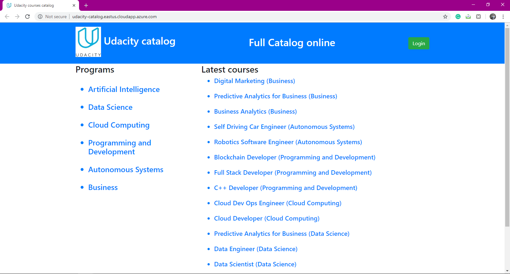

# Linux-Server-Configuration
This is the last udacity project in the FSND.

**by  Sid Ali Mahmoudi**

## Description of Udacity Linux Server Configuration project

In this project, I'll take a baseline installation of a Linux server and prepare it to host my flask web application. I'll secure my server from a number of attack vectors, install and configure a database server, and deploy one of my existing udacity_catalog onto it.

## Server Infos

- Server public IP address : ```40.76.76.121```, SSH port : ```2200```
- Web application full [URL](http://udacity-catalog.eastus.cloudapp.azure.com)
- To Connect to the server, use this command : ``` ssh -i grader_keys grader@40.76.76.121 -p 2200 ```

## Summary of software installed and configuration changes made

- [x] 1. Create a new Ubuntu Server Virtual Machine on [Azure Portal](http://portal.azure.com), (if you want to get started with Azure VM, check the [official documentation](https://docs.microsoft.com/en-us/azure/virtual-machines/?WT.mc_id=AzPortal_VM_modern_CmdBar_DocLink).

- [x] 2. Create a new user named ```grader``` and give it the sudo permission.

- [x] 3. Set up ssh-key for ```grader``` user.

- [x] 4. Add the public key to the server.

- [x] 5. Enforce Key-based SSH authentication for all users.

- [x] 6. Change the SSH default port *22* to *2200*

- [x] 7. Configure the firewall to only allow the http (*80*), ssh (*2200*) and NTP (*123*).

- [x] 8. Update the system applications.

- [x] 9. Configure local timezone to UTC.

- [x] 10. Install Apache2, mod_wsgi, and PostgreSQL applications.

- [x] 11. Create a new database user named ```catalog``` that has limited permissions to the catalog application database, then desable remote connections.

- [x] 12. Install [Git](https://git-scm.com/downloads).

- [x] 13. Clone the [Item catalog](https://github.com/SidaliMahmoudi/item_catalog) project from Github.

- [x] 14. Install the needed python libraries : flask, sqlalchemy, psycopg2, oauth2client, httplib2, requests using ```sudo -H pip3 install library-name```.

- [x] 15. Create and configured the ```catalog.wsgi``` application.

- [x] 16. Edit the ```udacity_catalog.py``` file and change the engine from sqlite to connect to the postgresql database.

- [x] 17. Set up a domain name for the server http://udacity-catalog.eastus.cloudapp.azure.com

## Output



## Used resources

- https://github.com/stueken/FSND-P5_Linux-Server-Configuration

- https://www.digitalocean.com/community/tutorials/how-to-deploy-a-flask-application-on-an-ubuntu-vps

## Licence

The MIT License ([MIT](https://choosealicense.com/licenses/mit/#))
Copyright (c) [2019] [Sid Ali Mahmoudi]


